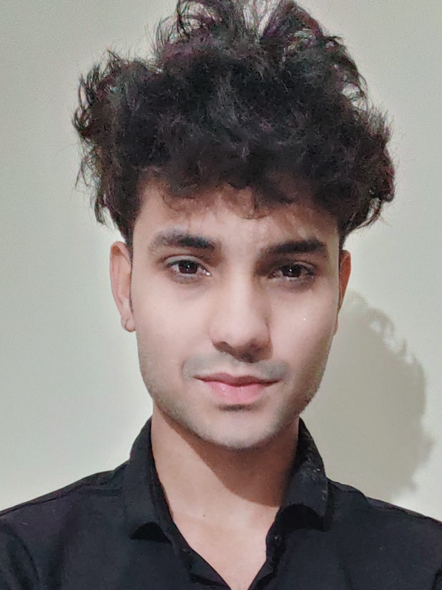

  

# 👋 Hi, I'm Mohammad Runna Sheikh

### 💻 Developer | Learner | Creator

I'm a passionate developer who loves building creative, clean and impactful projects. I enjoy exploring new technologies and improving my skills every day.

🌍 **Noida**
🏢 **Globallogic**
🔗 **Portfolio:** [https://runna-sheikh-studio.vercel.app/](https://runna-sheikh-studio.vercel.app/)
🔗 **Website:** [https://scjhaofficial.com/](https://scjhaofficial.com/)

---

## 🚀 Tech Stack

**Languages:** JavaScript, Dart, Python, C/C++

**Frameworks & Tools:**

* Flutter
* Node.js / Express basics
* HTML / CSS / JS
* Git & GitHub

---

## ⭐ Featured Projects

### 🔹 Project 1 — *Your best project name here*

---

## 🤝 Connect With Me

* 📧 Email: mohammadrunnasheikh@gmail.com
* 🔗 https://www.linkedin.com/in/mohammad-runna-sheikh-38b05125a/

---

### ⭐ "Code. Improve. Repeat." — My Developer Journey Begins Here
